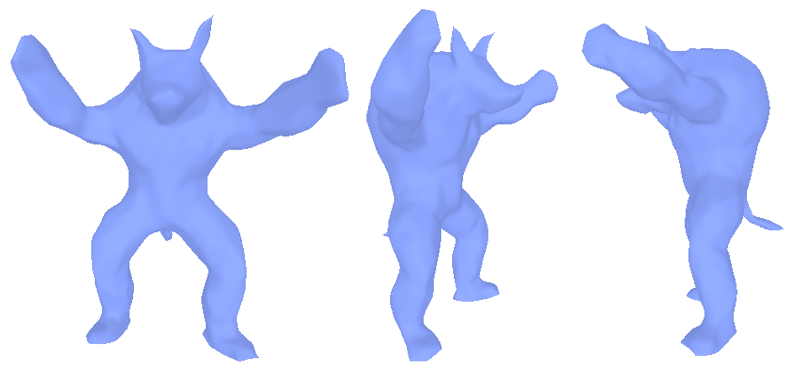
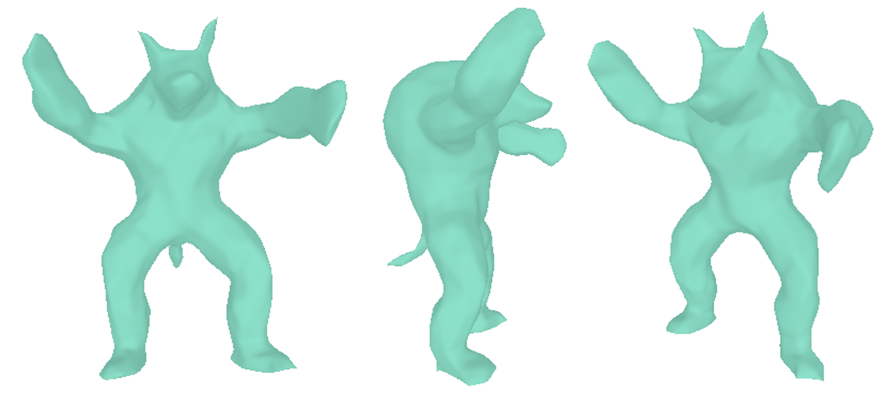
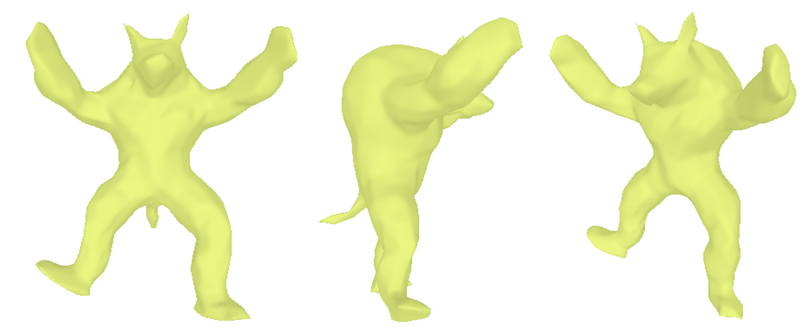
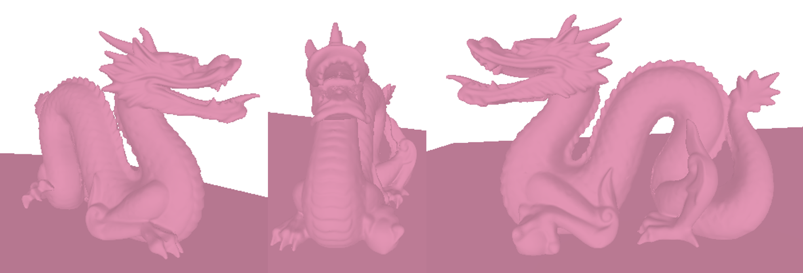
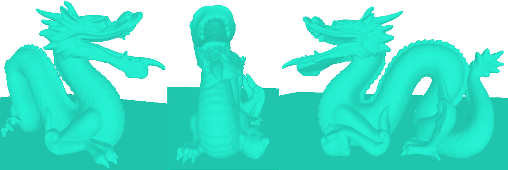

# python-mesh-deformation
University pair project implementing simple mesh deformation based on Laplacian Surface Editing by Sorkine et al [1]. 

*Overview*: Meshes are loaded, then a handle and anchors are chosen manually. The desired position of the handle is then chosen through a simple 2D UI. Mesh deformation is then carried out based on this new position.

Libraries used:
* numpy
* matplotlib
* robust-laplacian
* Trimesh
* NetworkX
* SciPy (for sparse optimisation)

## Examples
### Armadillo
Original Armadillo model[2]
 

Armadillo with left arm lowered

Armadillo with right leg raised

### Dragon
Original Dragon model[2]
 

Dragon with mouth opened

## References
[1]:  O. Sorkine, D. Cohen-Or, Y. Lipman, M. Alexa, C. Rossl and H.-P. Seidel, “Laplacian Surface Editing,” in Symposium on Geometry Processing, Nice, 2004. https://igl.ethz.ch/projects/Laplacian-mesh-processing/Laplacian-mesh-editing/

[2]: “The Stanford 3D Scanning Repository,” Stanford University, [Online]. Available: http://graphics.stanford.edu/data/3Dscanrep/. [Accessed 06 January 2021].

